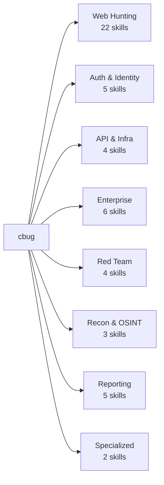
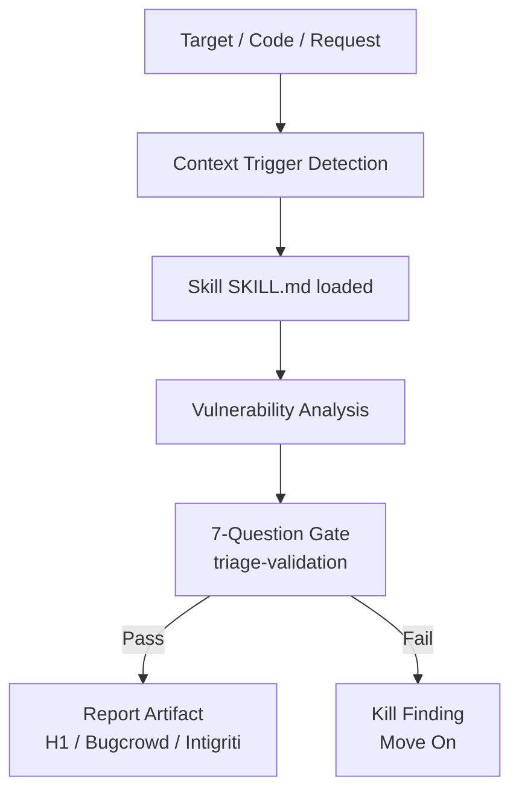

<div align="center">

# cbug


**51 specialized Claude skills for bug hunting, web security, and external red-team workflows.**


</div>

cbug is a Claude skill bundle adapted from real bug bounty disclosures. Each skill loads specialized context — vulnerability patterns, PoC templates, and report structures — derived from hundreds of public HackerOne and Bugcrowd reports. Skills activate by context in both Claude Chat (static analysis) and Claude Code (live target scanning). A built-in 7-Question Gate runs before every report to keep your N/A ratio clean.

---

## What it does

- **Hunt live targets** — Run `/hunt target.com` in Claude Code and get a streamed findings report with PoC steps
- **Review code statically** — Upload the skill ZIP to claude.ai, paste any code or HTTP request, and receive a structured findings artifact
- **Auto-load by context** — Skills detect their own trigger signals (JWT in input → auth skill loads, APK path → apk-redteam-pipeline loads)
- **Gate before submit** — Every finding runs the 7-Question Gate. One wrong answer kills the report
- **574+ H1 patterns** — Built from disclosed reports across SQLi, XSS, OAuth, IDOR, SSRF, RCE, and 15 other classes

---

## Key features

| Feature | Description |
|---|---|
| 51 skills | 8 domains: web-hunting, auth, api-infra, enterprise, red-team, recon, reporting, specialized |
| 15 slash commands | `/hunt`, `/triage`, `/report`, `/recon`, `/chain`, and 10 more |
| 7-Question Gate | Built into triage-validation — kills speculative reports before they reach a triager |
| Context auto-load | Skill triggers on URL, JWT, APK path, contract address, or domain signal |
| Chat + Code | Every skill documents which Claude environment supports it |
| Report templates | H1, Bugcrowd, Intigriti, and Immunefi formats with impact-first structure |

---

## Skill domains



---

## Architecture



---

## Quick start

```bash
# Claude Code (live target scanning)
git clone https://github.com/elementalsouls/Claude-BugHunter
cd Claude-BugHunter
claude

# Start a hunt
/hunt https://target.com

# Or target a specific class
/hunt-sqli https://target.com/search?q=test
```

For Claude Chat (static code review):
1. Download the skill ZIP from [Releases](https://github.com/elementalsouls/Claude-BugHunter/releases)
2. Upload to [claude.ai/customize/skills](https://claude.ai/customize/skills)
3. Paste your code or HTTP request and type the skill command

---

## Project structure

```
cbug/
├── skills/
│   ├── web-hunting/      ← 22 skills: SQLi, XSS, SSRF, IDOR, RCE, and more
│   ├── auth-identity/    ← 5 skills: OAuth, ATO, auth bypass, SAML, MFA
│   ├── api-infra/        ← 4 skills: API misconfig, cloud misconfig, GraphQL, NTLM
│   ├── enterprise/       ← 6 skills: M365, Okta, vCenter, IAM, VPN, SharePoint
│   ├── red-team/         ← 4 skills: APK pipeline, supply chain, IR detection, mindset
│   ├── recon-osint/      ← 3 skills: OSINT methodology, offensive OSINT, subdomain
│   ├── reporting/        ← 5 skills: triage gate, report writing, evidence hygiene
│   └── specialized/      ← 2 skills: web3 audit, meme-coin audit
│
├── commands/             ← 15 slash command definitions
│   ├── hunt.md           ← /hunt — primary live hunt command
│   ├── triage.md         ← /triage — 7-Question Gate runner
│   ├── report.md         ← /report — report generator
│   ├── recon.md          ← /recon — recon pipeline
│   └── ...
│
├── docs/                 ← MDX documentation
│   ├── quick-start.mdx
│   ├── install.mdx
│   ├── chat-vs-code.mdx
│   └── 7-question-gate.mdx
│
├── web/                  ← Next.js 14 showcase site
│   ├── app/              ← App Router pages
│   ├── components/       ← UI, layout, sections
│   ├── content/          ← domains.ts, skills.ts, demos.ts
│   └── lib/utils.ts
│
└── tests/                ← vitest suite — validates skill structure
    └── skills.test.ts
```

---

## Slash commands

| Command | What it does |
|---|---|
| `/hunt [target]` | Full recon + vulnerability scan on a live target |
| `/hunt-sqli [target]` | SQLi-focused hunt using 12 disclosed report patterns |
| `/hunt-xss [target]` | XSS hunt across DOM, reflected, stored, and mutation variants |
| `/hunt-oauth [target]` | OAuth 2.0 and OIDC vulnerability hunt |
| `/triage` | Run the 7-Question Gate on the current finding |
| `/report` | Generate a report artifact for the current finding |
| `/recon [target]` | 5-stage recon pipeline: seed → expand → enrich → expose → report |
| `/chain` | Link recon findings into an exploit chain |
| `/intel [target]` | OSINT and threat intelligence on a target |

Full command reference in [`commands/`](./commands/)

---

## Hard rules

1. **Never submit without the Gate.** `/triage` runs 7 questions. One No = kill it.
2. **Every skill is a single `SKILL.md`.** Do not split skill logic across files.
3. **Authorized targets only.** These skills are for bug bounty programs and authorized red teams.
4. **Chat skills are read-only.** No live tool execution in Claude Chat environment.

---

## Attribution

Skills adapted from [elementalsouls/Claude-BugHunter](https://github.com/elementalsouls/Claude-BugHunter) (MIT License).

cbug is an independent project and is not affiliated with or endorsed by Anthropic.

## License

MIT
